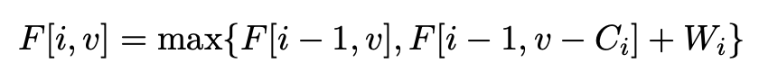
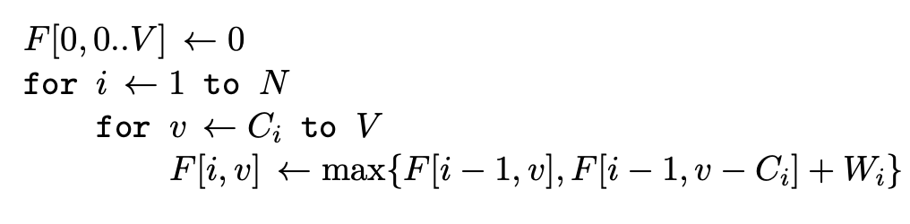
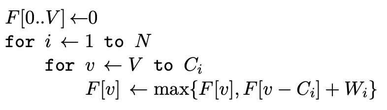
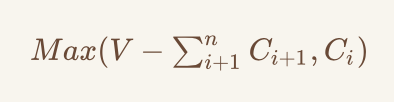

## 1 01背包问题

### 1.1 问题描述

有N件物品和一个容量为V的背包。放入第i件物品耗费的容量（或费用）为C[i]，得到的价值是W[i]。求解将哪些物品装入背包可使价值总和最大。

### 1.2 基本思路

这是最基础的背包问题，特点：每种物品仅有一件，可以选择放或不放。

#### 1.2.1 状态转移方程

F[i,v]表示将前i件物品放入容量为v的背包中所得到的最大价值。对于01背包问题，我们可以将问题转化为只和前i-1件物品相关的问题，因此，现在只需考虑第i件物品的策略（放 or 不放）。因此F[i,v]的值应取max{不放，放}。

#### 1.2.2 伪代码

在这里算法的空间复杂度为O(VN)，可以继续优化成O(V)，但时间复杂度应该已经不能再优化了。其中最终问题的解即为F[N,V]

* 关于初始化：在伪代码的第一行，我们可以看到程序将F[0,0..V]，也就是第0行的值全部初始化为0，这里的实际意义也是很好理解的，因为F[i,v]代表将前i件物品放入容量为v的背包中所获得的最大价值，因此前0件物品不论放入容量多大的背包中其获得的价值都是为0的。

### 1.3 优化空间复杂度

前面在1.2.2中提到，空间复杂度可以优化为O(V)，那我们如何使用一维的数组实现这个问题呢？

如果转化为使用一维数组F[V]，那么原本的F[i,v]即变成了F[v]，而F[i-1, v-C[i]]即变为F[v-C[i]]，但F[i-1,v]在一维数组中怎么表示呢？它明显是代表了前一行的数据，既然v的坐标是与等号前面相同的，那我们很容易的会联想到使用当前的F[v]作为原来的F[i-1, v]。但如此一来，第二个循环就需要变为降序，这样才能保证更新F[v]前的值为上一次外循环的值（也就是F[i-1,v]），同时保证了F[v-C[i]]也为上一次外循环产生的值（也就是F[i-1, v-C[i]]）。反过来一想，如果我们还是对内循环采用升序的话，会造成什么后果呢，在本次内循环更新前的F[v]的确是上一次外循环产生的值，但却会导致在下一个内循环中我们所要使用F[v-1]变为了本次外循环的值（我们用到的本应该是F[i-1, v-C[i]]）。因此状态转移公式就变成了F[i,v]是由F[i,v-C[i]]推导得到的，显然与本题意不符。

#### 1.3.1 伪代码

* 关于初始化：由于该数组要存储一次外循环所更新的值，因此在循环之前的初始化操作就需要得到将前0件物品放入背包容量为0到V时所得到的最大价值，所以初始化其值为0。

### 1.4 一个常数优化

首先给出优化后的结果：

将1.3.1中的第三行，也就是内循环的最小取值变为

ps：这里感觉原书的公式有两个错误，一个是将C写成了W，另一个是下标的问题，我觉得下标从i+1开始才解释的通。

* 下面给出解释：据1.3.1中的伪代码的最后一行我们可以得出这样的结论，因为我们问题的最后答案其实是F[V]，所以当计算第n个（这里n代表最后一个）物品的时候，其实只需要知道F[V-c[n]]的值是多少就可以了（因为另外一个F[v]其实就是上一轮的当前位置的值啊！），而由于F[V-c[n]]是通过第n-1个物品的循环计算得到的，因此计算该值的时候需要根据F[V-c[n]-c[n-1]]的值才行。所以总结一下，计算第n个物品时，只需要计算F[V]，而计算第n-1个物品时，需计算至F[V-c[n]]。由此推导，在计算第i个物品时，需要计算至F[V-(c[n]+c[n-1]+...+c[i+1])]，也就是上图中max函数的第一项参数。

### 1.5 Leetcode相似例题

To be continued, bye!

